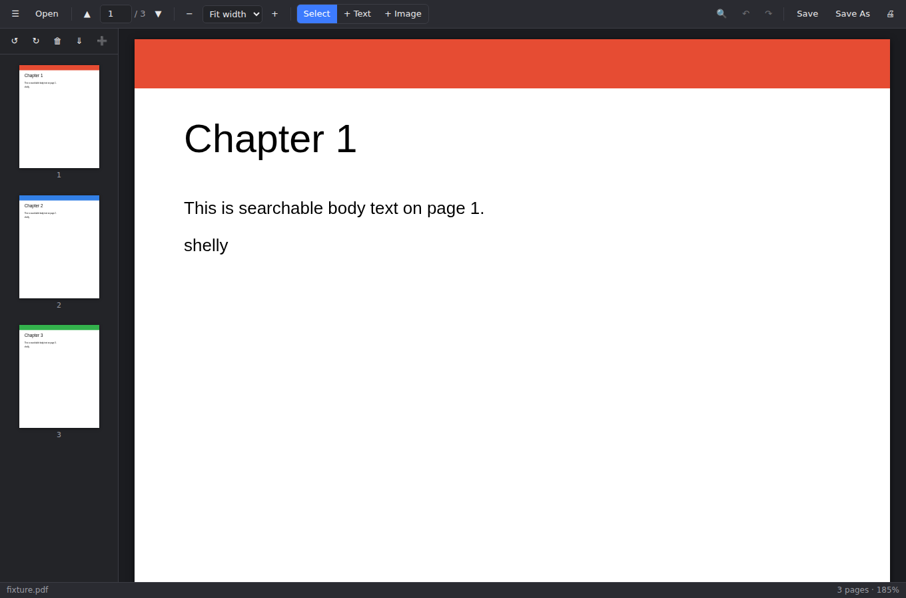
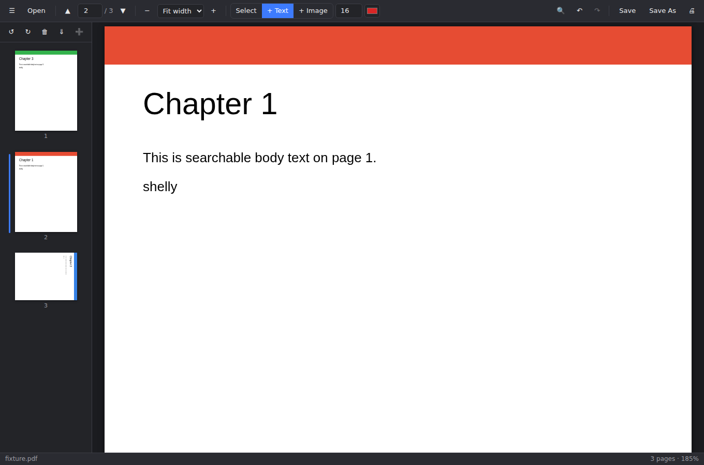

# Shelly PDF

A desktop PDF reader & editor built with Electron — an Acrobat-Reader-style app for
viewing PDFs and doing everyday edits. Everything runs locally; your files never
leave your machine.




## Features

**Read**
- Open PDFs via dialog or drag-and-drop
- Continuous scrolling, page navigation, thumbnail sidebar
- Zoom: presets, fit-width, fit-page (`Ctrl+=`, `Ctrl+-`, `Ctrl+0/1/2`)
- Selectable text and full-document search with highlighted matches (`Ctrl+F`)
- Print (`Ctrl+P`)

**Organize pages** (thumbnail sidebar — click to select, `Ctrl`/`Shift`-click for multi-select)
- Rotate pages left/right
- Delete pages
- Drag thumbnails to reorder pages
- Extract selected pages to a new PDF
- Insert/merge all pages from another PDF

**Add content**
- **+ Text** — click anywhere on a page to add a text box; set font size and color;
  drag to reposition; edits are baked into the PDF when you save
- **+ Image** — place a PNG/JPEG stamp on a page; drag to move, corner handle to resize

**Safety**
- Undo/redo for all edits (`Ctrl+Z` / `Ctrl+Shift+Z`)
- Unsaved-changes indicator in the title bar and a save prompt before closing

> Note: like all non-Acrobat-Pro tools, Shelly adds content *on top of* pages.
> It does not rewrite a PDF's existing typeset text, and password-protected PDFs
> are not supported.

## Run it

Requires [Node.js](https://nodejs.org) 20+.

```bash
npm install
npm start
```

## Build installers

```bash
npm run dist
```

Produces a platform installer in `release/` (AppImage on Linux, DMG on macOS,
NSIS installer on Windows) via electron-builder.

## Development

| Command | What it does |
|---|---|
| `npm run build` | Bundle the renderer (Vite) into `dist/` |
| `npm test` | Unit tests for the PDF edit engine (Vitest) |
| `node scripts/smoke.mjs` | End-to-end smoke test: drives the built renderer in Chromium — open, render, search, rotate, reorder, delete, overlay bake, undo, zoom |
| `node scripts/bake-roundtrip.mjs` | Visual check that saved text/images land exactly where they were placed, including on rotated pages |

### Architecture

```
electron/main.cjs     Electron main process: window, app menu, native open/save
                      dialogs, file IO over IPC. Serves the bundle over a
                      custom app:// protocol (file:// pages can't spawn the
                      pdf.js worker).
electron/preload.cjs  Sandboxed contextBridge API (window.shelly)
src/app.js            State, wiring, undo/redo, save flow. Falls back to file
                      input + download when run in a plain browser.
src/pdf-engine.js     All PDF mutation (pdf-lib): rotate/delete/reorder/extract/
                      insert/bake — pure bytes-in/bytes-out, unit-tested
src/viewer.js         pdf.js rendering: lazy page render, zoom, text layer
src/thumbnails.js     Sidebar: selection, drag-to-reorder
src/search.js         Find bar: match location + highlight painting
src/overlays.js       Text/image overlay objects and coordinate mapping
```

The document lives as PDF bytes (source of truth). Structural edits run through
`pdf-engine.js` and the viewer reloads from the new bytes; text/image overlays stay
editable as DOM objects and are only drawn into the PDF on save. Manual test
checklist: open → search → rotate/reorder/delete → add text/image → save → reopen
the saved file and confirm everything stuck.
